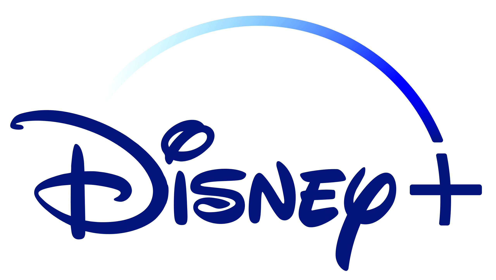

# Microsoft Enagage 2022 - Algorithms

<h3> Recommendation System - Disney Plus Shows </h3>

<!-- PROJECT LOGO -->
 

  
 

 

We use the Disney Plus Shows dataset 
     
    <a href=https://github.com/AnjaniSriya/RecommendationSystem/blob/master/disney_plus_shows.csv><strong>Explore the dataset »</strong></a>
     
     
    <a href="https://share.streamlit.io/anjanisriya/recomendationsystem/index.py">View Demo</a>
    ·
    <a href="#">Video Demo</a>
  

<!-- TABLE OF CONTENTS -->

  
Table of Contents

  <ol>
    <li>
      <a href="#about-the-project">About The Project</a>
      <ul>
        <li><a href="#built-with">Built With</a></li>
      </ul>
    </li>
    <li>
      <a href="#Screenshots">Screenshots</a>
    </li>    
    <li><a href="#contact">Contact</a></li>
  </ol>

<!-- ABOUT THE PROJECT -->
## About The Project

My project is the third problem statement - Algorithms. Through my project, I presented the various types of algorithms that a web-streaming service (such as Netflix) might use for their Recommendation Engine. We can create a Recommendation Engine in a variety of methods. My project is a Content-based Recommendation System.
Content-based recommendation system makes recommendations based on item metadata such as genre, director, description, actors, and so on. The main premise underlying these recommender systems is that if a person likes one item, he or she will also enjoy a similar item.
 
The following are the approaches I implemented in this project.
* APPROACH 1 : Weighted_rating:
* APPROACH 2 : Rapid Automation Keyword Extraction (RAKE)  
* APPROACH 3 : Bidirectional Encoder Representations from Transformers (BERT) model

### Built With

This section includes a list of platforms, frameworks and libraries that were utilised to create this project.

* [Streamlit](https://docs.streamlit.io/)
* [Google Colab](https://research.google.com/colaboratory/)
* [Python](https://www.python.org/)
* [rake-nlkt](https://pypi.org/project/rake-nltk/)
* [Scikit-learn](https://scikit-learn.org/stable/)
* [BERT-Distilled BERT](https://huggingface.co/docs/transformers/model_doc/distilbert)
* [pickle](https://docs.python.org/3/library/pickle.html)

<!-- SCREENSHOTS -->
## Screenshots

<h3> Results of Approach 2 for the movie 102 Dalmatians </h3>

<h3> Results of Approach 3 for the movie 102 Dalmatians </h3>

<!-- CONTACT -->
## Contact

Pesala Anjani Sriya 

[![LinkedIn][linkedin-shield]](https://www.linkedin.com/in/anjani-sriya-p/)

[license-url]: https://github.com/othneildrew/Best-README-Template/blob/master/LICENSE.txt
[linkedin-shield]: https://img.shields.io/badge/-LinkedIn-black.svg?style=for-the-badge&logo=linkedin&colorB=555

